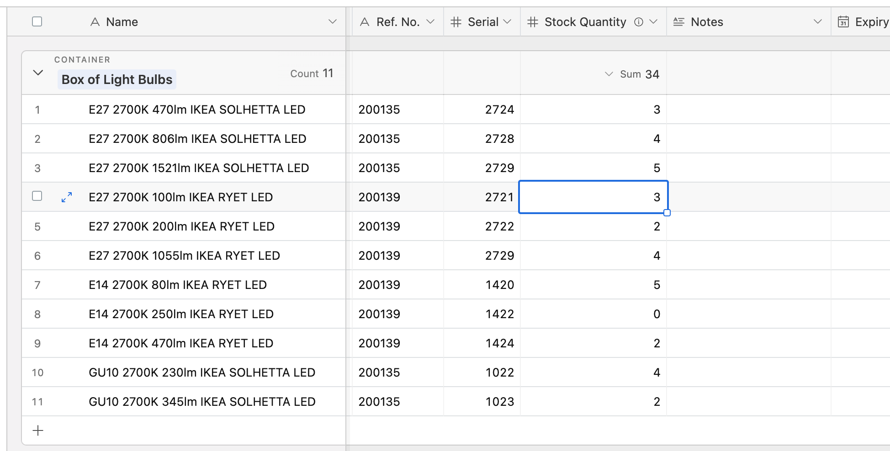
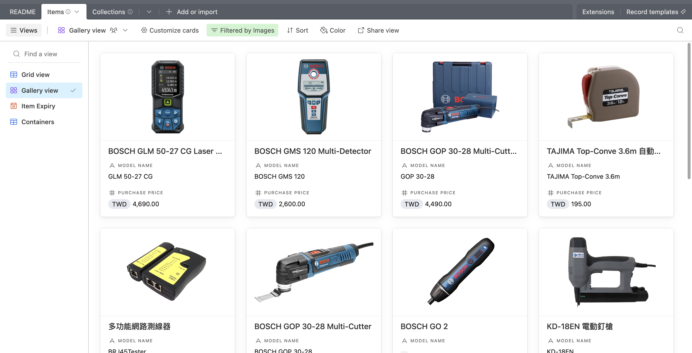
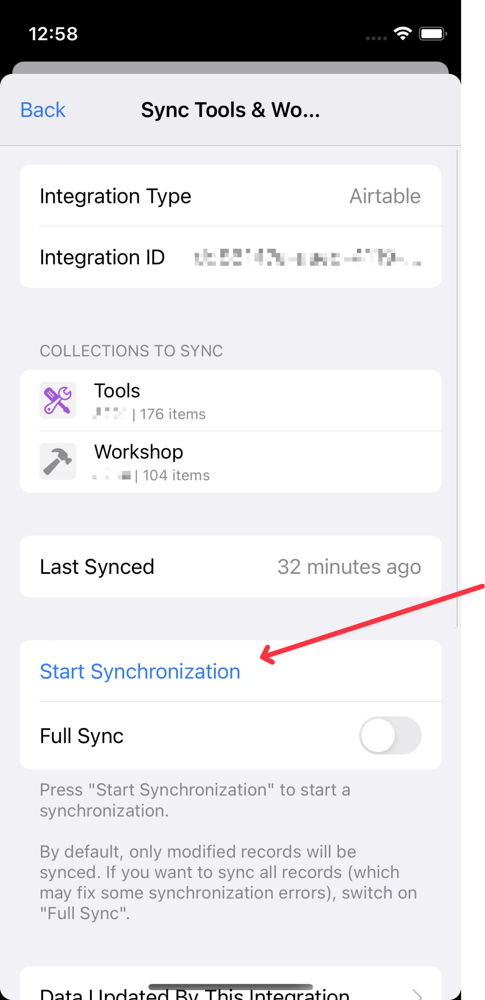
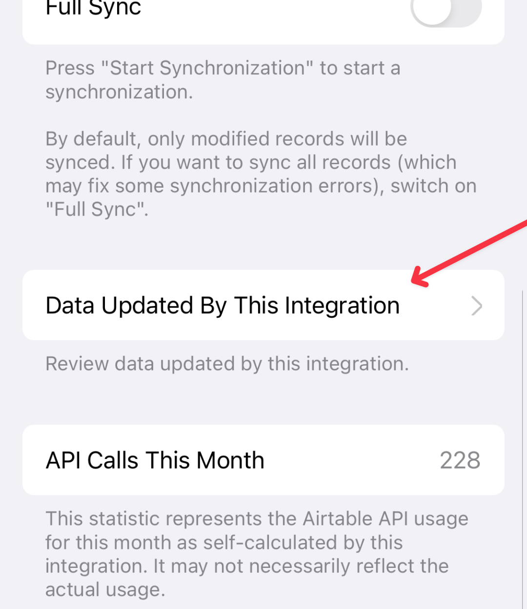
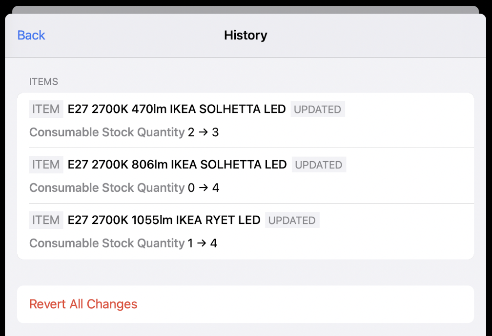

# Airtable Integration

The Airtable integration offers the capability to sync items with an Airtable base. This feature empowers you to efficiently manage and organize items using Airtable's user-friendly spreadsheet-like interface with various viewing and filtering options.

 

## How It Works

Here's a brief overview of how to make this integration work:

1. **Copy Template Base:** Start by copying a template Airtable base.
2. **Set Up Integration:** Configure the integration in the app, choosing items to sync and the Airtable base to sync with.
3. **Sync:** When you sync, changes are updated between the app and Airtable. The most recently modified data will override the other.

## Limitations

1. **Airtable restrictions**: Depending on your Airtable [plan](https://airtable.com/pricing), there may be limits on the number of records per base and API calls per month. Exceeding these limitations may prevent the integration from working. To save these quotas, you can sync only the necessary items you want, perform a sync only when needed, or create a new workspace to sync your data.
2. **Do not delete a record in Airtable; use a special checkbox to mark the record as should-be-deleted instead**: Deleting a record may break the integration while the record will simply disappear without anyone knowing that it should be deleted. Instead of deleting a record, one should check the checkbox on the "Delete" field, and that record will be deleted both on Airtable and the app during the next sync. If a record is accidentally directly deleted in Airtable, performing a full sync might resolve the inconsistency.
3. **Not able to rename synced tables and fields**: Renaming or removing synced tables or fields can disrupt the integration or even corrupt your data. While you are free to add new tables or fields, be aware that these additions will not sync back to the Inventory system.
4. **Beware of overlapping edits**: The sync is not performed in real-time, and changes made on the same item will be overwritten by the last edit made. It is considered best practice to initiate a sync both before and after using Airtable to edit data to minimize the risk of data conflicts.
5. **You'll need a server to sync images from and to Airtable**: You'll need to have your database synced with a remote CouchDB server and have a public image access endpoint to sync images from and to Airtable.
6. **The power comes with risks**: The Airtable integration, unlike CSV import, does not offer a preview of changes during synchronization. Unwanted changes might occur. Do review the data updated by the integration frequently (go to "Data Updated by This Integration" in the integration screen), and revert any unwanted changes as soon as possible if you find any.
7. **Performance concerns**: The current implementation has performance concerns. We suggest not to sync more than 1000 items through one single integration.

## Setup

To set up an Airtable integration, go to **Settings** → **Integrations** → **Add Integration** and select "Airtable." Follow the instructions in the app to complete the setup.

The following are instructions you may need for some of the steps.

### Prepare your Airtable base and get the base ID

1. Open this [template base](https://airtable.com/appKkuSub43QsedfN/shrdaSvkwaYwRmCFZ), and click "Copy base" at the top of the page.\
   
2. Open the copied base and click the dropdown icon on the top to rename your base. You can also select a custom color and icon.\
   
3. Check the URL of your space. Extract the part between the first and second `/` after `https://airtable.com`, that is your base ID.\
   For example, `https://airtable.com/appkerRLVkDoMWQXB/tbl8oDcDYNKKht4eO/viwKm29KCru8FCZi2?` -> `appkerRLVkDoMWQXB` is your base ID.\
   @2x.png>)

### Get a personal access token

1. Open [https://airtable.com/create/tokens](https://airtable.com/create/tokens), click "Create token" under "Personal access tokens".\
   .png>)
2. ➊ Enter a recognizable name for your access token. ➋ Click "Add a scope" and add the 4 scopes: `data.records:read`, `data.records:write`, `schema.bases:read` and `schema.bases:write`. ➌ Click "Add a base" and select the base you want to integrate with.\
   Your page should look similar to the following image. Click "Create token" after you're done.\
   
3. You're personal access token is now ready. Copy it for further usage.\
   .png>)

### Using A Public Images Endpoint

To sync your item images from and to Airtable, you'll need public URLs for your images which Airtable will use to download them from. One way to do this is through using the [`couchdb-public-server`](https://github.com/zetavg/Inventory/tree/main/packages/couchdb-public-server) package.

If you use `couchdb-public-server`, your public images endpoint should be:

```
http(s)://<your_couchdb_public_server_host_name>/<couchdb_database_name>/images
```

You can try to access `http(s)://<your_couchdb_public_server_host_name>/<couchdb_database_name>` to check if your server works. See the console output for error messages.

## Usage

1. Press the "Start Synchronization" button to start a sync. Only the data modified after the last sync will be synced.\
   \
   \
   If you find anything that is not synced correctly, switch on "Full Sync" and press "Start Synchronization" to do a full sync. If an error occurred during sync, performing a full sync may also fix it.
2. To ensure things went as expected, you can review the data updated by the integration.\
   
3. If you find any unwanted changes, you can revert it by pressing on an item, or revert all changes by pressing "Revert All Changes." The reverted changes will be synced back to Airtable on the next sync.\
   
